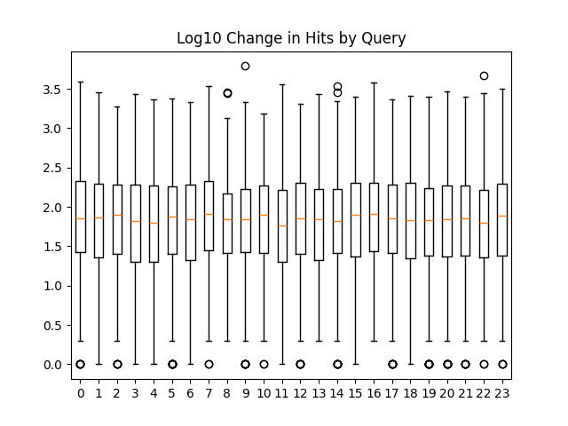

# What is this?

This repository contains data and (eventually) analysis of metadata I gathered from works on [Archive of Our Own](archiveofourown.org). Starting on 11-11-2023 I searched the archive for all newly updated works every hour for 24 hours and then searched again a day later to try to capture the same set of works. The scirpt captured the change over a 24 hour period of 10,829 works.

Over the next week, I queried the archive for every tag in the dataset yielding 100,300 total tags with 67,983 of them being canonical tags. All canonical tags and inherited metatags were recorded for each work.

I gathered the set of all parent tags of tags observed in the original dataset. Note that tags maybe have been wrangled in the intervening period.

Analysis is a work in progress, but for now I figured I'd make the data availible. The tags and works data are availible as .json files and as pickled datastructures with Work and Tag objects from my fork of ao3-api.

# Works

The works file is a list of 24 dictionaries. See ao3_datascraper.py for how I generated it. A bug caused the last three iterations to have started a day late and with a 2 hour time difference between queries instead of 1 hour. Cursory inspection of the distribution of the change in hits per work shows no obvious differences between batches despite this.

# Tags

See ao3_dataprocessor.py for how I queried the archive for tags. To reduce queries, tags were cached in a dictionary and exported to tagCache_uncompressed_final.zip. All tags and their metatags were queried. For the uninitiated, a metatag is an inherited tag. For example, "X-Men - All Media Types" has "Marvel" as a metatag since all X-Men works must also be Marvel works. The archive doesn't show these inherited tags by default which is what necessitated this whole process in the first place.

# Hits and Kudos within Tags

I investigated the distribution of Hits and Kudos by Tag and in total to get an idea of which tags are under represented by authors. The idea being, if a tag has a large number of Hits/Kudos per work then there are more readers interested in reading those works than there are authors interested in publishing.

We can see fandoms like 'Harry Potter - J. K. Rowling' have both a high volume of readers and a high volume of fics while other fandoms like 'House of the Dragon' have a high volume of readers, but a lower number of fics.

'Additional Tags' are hidden in the visualization below to prevent NSFW tags from being shown.

    
    <tableau-viz id="tableauViz" src='https://public.tableau.com/views/AO3_Observed_Data/ChangeWork?:language=en-US&:display_count=n&:origin=viz_share_link' toolbar="bottom">
    </tableau-viz>

